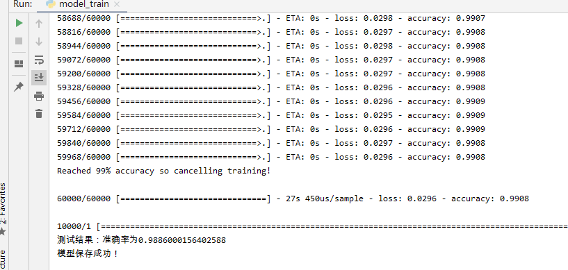
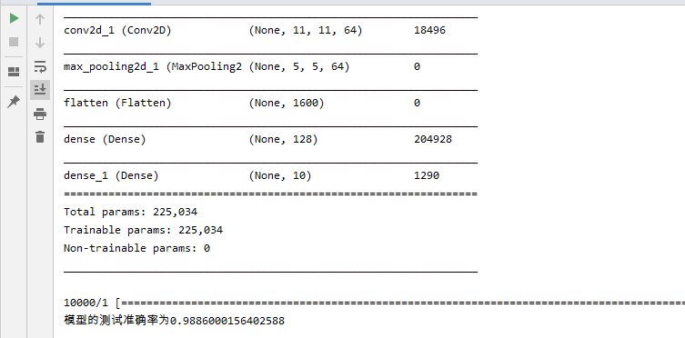
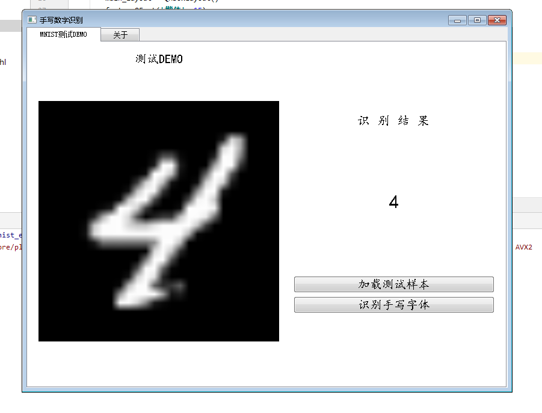

# tensorflow2.0_mnist
基于tensorflow2.0完成的手写数字识别系统-含有有图形化界面


## 文件目录
```bash
|--images 图片的存放目录，这里我放置了一些图片用于装饰界面
|--model 模型的存放目录，训练好的模型将会存放在这个文件夹下
|--model_train.py 模型的训练代码，直接执行将会保存模型到model文件夹下
|--model_test.py 模型的测试文件，计算模型的准确率，或者你可以使用这个文件来进行单一文件的测试
|--minist_window.py 可视化界面，在这个界面下，你可以进行可视化的操作来完成手写数字的识别
```

## 如何使用
首先你需要git项目到你的本地

确定你的电脑已经安装好了PyQt5、tensorflow2.0以及opencv-python等相关软件，你可以执行下列命令进行安装
```
conda create -n mnist_demo 
pip install PyQt5
pip install tensorflow==2.0.0
pip install opencv-python(windows下直接将opencv_python-4.1.2-cp36-cp36m-win_amd64.whl放到虚拟环境下Lib/site-packages进行pip install opencv_python-4.1.2-cp36-cp36m-win_amd64.whl即可，windows下在线安装会报not found model vc2)
```

如果你想要训练你的模型，执行
```
python model_train.py
```
如果你想要测试模型的准确率，执行
```
python model_test.py
```
如果你想看看图形化的界面，请执行
```
python mnist_window.py
```


## 执行效果
### 训练效果



### 测试效果



### 图形化界面



